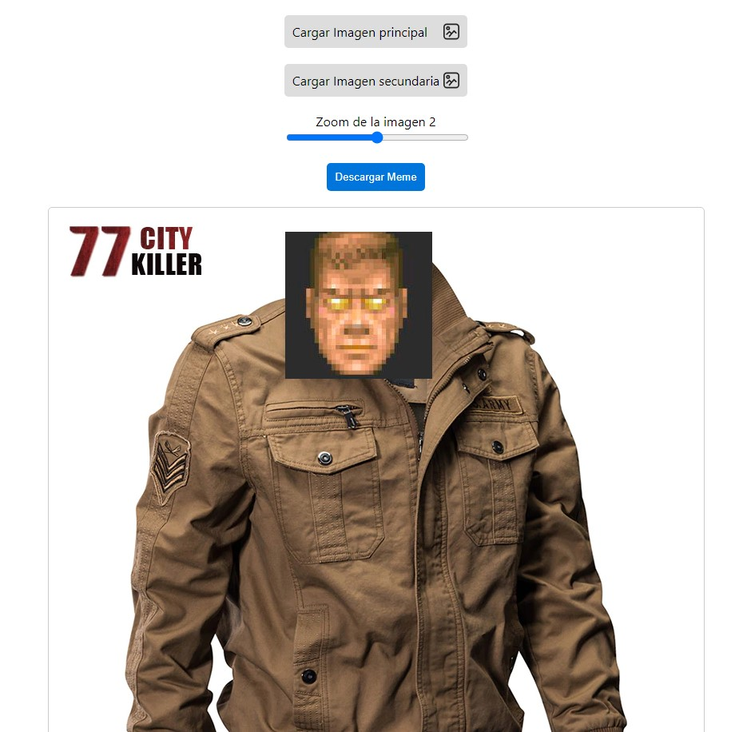
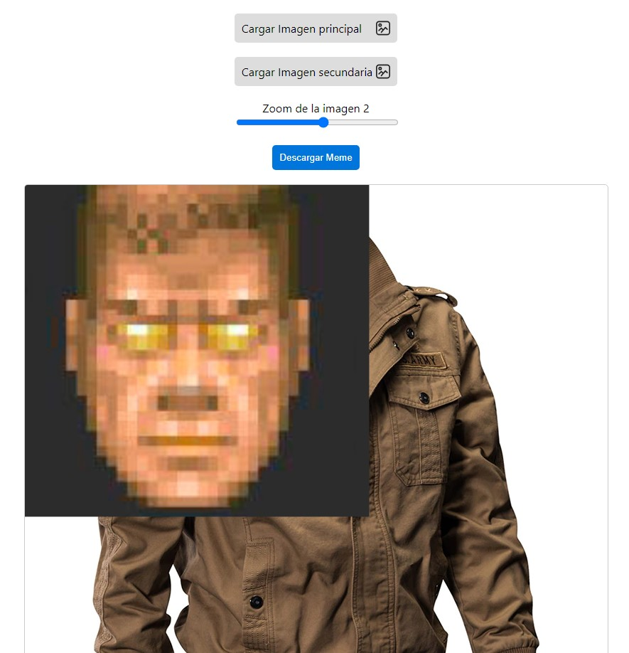

# Meme Generator

Esta app es para generar memes combinando dos imagnes distintas.

Mirá la Live [DEMO](https://pixlking.github.io/meme-generator/)

### Para correr el proyecto

Clonar el repo y hacer ´npm install´ y luego ´npm run start´
